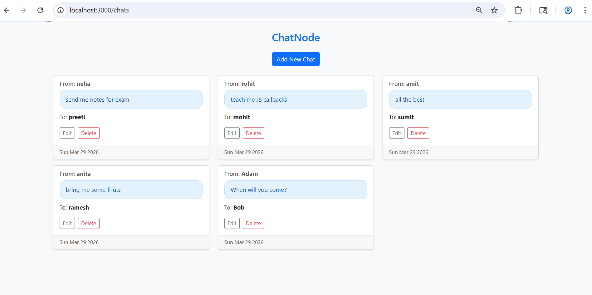
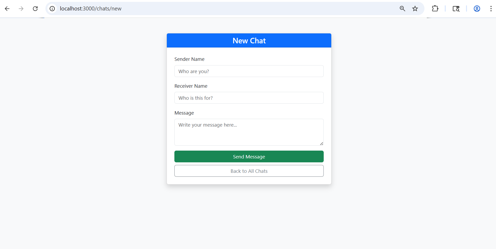
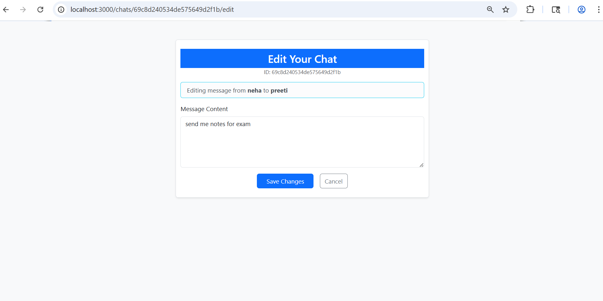

# 📱 ChatNode

A sleek, lightweight messaging application built with the **MEN stack** (MongoDB, Express.js, Node.js). This project features a responsive UI styled with **Bootstrap 5** and custom CSS, supporting full CRUD operations for chat management.

## 🔗 Live Demo
Check out the live application here: **[https://chatnode-uqfq.onrender.com]**  

## 📸 Project Gallery

| Home Page |
|------------|
|  |

| Create New Chat | Edit Chat |
|------------|-----------|
|  |  |

## 🚀 Features

*   **Full CRUD Functionality**: Create, read, update, and delete chat messages seamlessly.
*   **Modern UI**: Responsive design using **Bootstrap 5** components for a professional look.
*   **Persistent Storage**: Integration with **MongoDB** via Mongoose for data persistence.
*   **Custom Styling**: Eye-pleasing soft blue message bubbles and refined, slim headers.
*   **RESTful Routing**: Clean and predictable URL structures for all operations.

## 🛠️ Tech Stack

- **Backend**: Node.js, Express.js
- **Database**: MongoDB, Mongoose
- **Frontend**: EJS (Embedded JavaScript), Bootstrap 5, Custom CSS
- **Middleware**: `method-override` (for PUT/DELETE support)

## 🧠 What I Learned

During the development of **ChatNode**, I strengthened my full-stack fundamentals by overcoming several technical challenges:

*   **RESTful API Design**: Learned how to structure routes logically to follow industry standards for creating, reading, updating, and deleting data.
*   **Database Integration**: Mastered connecting an Express server to **MongoDB** using **Mongoose**, including schema definition and asynchronous data handling.
*   **Middleware Implementation**: Gained experience using `method-override` to handle `PUT` and `DELETE` requests from standard HTML forms that only support `GET` and `POST`.
*   **Frontend Refinement**: Deepened my knowledge of **Bootstrap 5** utility classes (Flexbox, Spacing, and Cards) and how to blend them with custom CSS for a unique brand identity.
*   **Data Seeding**: Created an initialization script (`init.js`) to automate database setup, ensuring a smooth developer experience for anyone cloning the repo.

## 📁 Project Structure

```text
├── assets/            # Project screenshots
├── models/
│   └── chat.js        # Mongoose Schema & Model definition
├── public/
│   └── style.css      # Custom CSS for chat bubbles
├── views/
│   ├── index.ejs      # Dashboard displaying all chats
│   ├── new.ejs        # Form to create a new chat
│   └── edit.ejs       # Form to update existing chats
├── index.js           # Main Express server logic
├── init.js            # Database seeding script
├── package.json       # Project dependencies and scripts
└── README.md          # Project documentation
```

## 💻 How Can You Run It Locally?

Follow these steps to get a local copy of the project up and running on your machine:

### 1. Prerequisites
Ensure you have **Node.js** and **MongoDB** installed on your system.

### 2. Clone the Repository
```bash
git clone https://github.com/techxkirti/ChatNode.git
cd ChatNode
```

### 3. Install Dependencies
Install all necessary packages listed in package.json:
```bash
npm install
```

### 4. Set up Environment Variables
Create a .env file in the root directory and add your MongoDB Atlas URI:
```env
ATLAS_DB_URL=your_mongodb_atlas_connection_string
```

### 5. Database Setup
Start your local MongoDB server. By default, the app connects to:
mongodb://127.0.0.1:27017/ChatNode

### 6. Seed the Database
Before running the app, populate your database with some initial chat data to see the UI in action:
```bash
node init.js
```

### 7. Start the Server
Run the following command to start the Express server:
```bash
npm start
```

### 8. Access the App
Open your web browser and go to:
http://localhost:3000

---
## 📈 Evolution: From ChatNode to Wanderlust

After mastering the RESTful fundamentals in this **ChatNode** project, I graduated to building **[Wanderlust](https://github.com/techxkirti/Wanderlust.git)**—a comprehensive full-stack Airbnb clone. 

While **ChatNode** focuses on core CRUD and MEN stack basics, **Wanderlust** takes it further with:
- **Cloud Database**: Full integration with **MongoDB Atlas** for persistent storage.
- **Authentication**: Secure user login and signup using **Passport.js**.
- **Cloud Media**: Professional image hosting and management via the **Cloudinary API**.
- **Complex UI**: Advanced styling and interactive maps.

🚀 **[Explore Wanderlust Live Here](https://wanderlust-w2pl.onrender.com/listings)**  
📁 **[Wanderlust Repository](https://github.com/techxkirti/Wanderlust.git)**